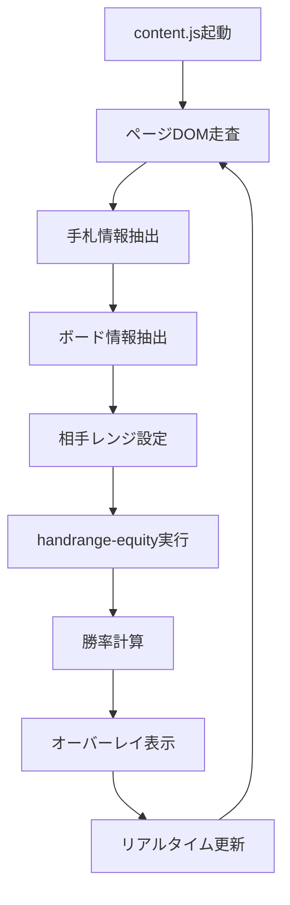

# ポーカー勝率表示Chrome拡張 開発指示書

## 🎯 プロジェクト概要

Web上のポーカーゲーム中に、自分の手札とボード情報から**推定勝率（エクイティ）**をリアルタイムで算出し、画面上にオーバーレイ表示するChrome拡張機能を開発する。

### 目的
- ポーカー学習支援
- 自分の立ち回りの定量評価
- ノーショウダウン時の勝率把握

## 🔧 技術スタック

| 構成要素 | 技術 | 詳細 |
|---------|------|------|
| 拡張機能 | Chrome拡張（Manifest v3） | 最新のManifest v3形式で実装 |
| DOM操作 | Content Script（content.js） | ページ内の手札・ボード情報を取得 |
| 勝率計算 | handrange-equity ライブラリ | モンテカルロシミュレーション |
| UI表示 | オーバーレイ（div要素） | ページに直接埋め込み形式 |

## 🧠 処理フロー



### 詳細ステップ
1. **content.js** がページを走査
2. 自分の手札とボード（公開カード）を抽出
3. 相手の手札が「不明」な場合は `random` または指定レンジで仮定
4. **handrange-equity** でモンテカルロシミュレーションを実行
5. 勝率（equity）を取得し、ページ上にオーバーレイ表示

## 🔐 扱う情報

| 種類 | 説明 | 例 |
|------|------|-----|
| 自分の手札 | DOMから読み取る | Ah, Ks |
| ボード（場札） | DOMから読み取る | 2d, 7s, Tc |
| 相手の手札 | 見えないため、ランダムorレンジ指定で仮定 | random |
| 勝率 | シミュレーションで算出 | 65.2% |

## 📋 DOM構造解析

### カード情報の取得方法

提供されたHTMLサンプルから、以下の構造でカード情報を取得：

```html
<div class="table-player-cards">
  <div class="card-container card-h card-s-9 flipped card-p1 med">
    <div class="card-flipper card-flipper-animated">
      <div class="front"></div>
      <div class="card">
        <span class="value" translate="no">9</span>
        <span class="suit sub-suit" translate="no">h</span>
        <span class="suit" translate="no">h</span>
      </div>
    </div>
  </div>
</div>
```

### 抽出ルール

| 要素 | 取得方法 | 対応 |
|------|----------|------|
| カードコンテナ | `.card-container` | 各カードの親要素 |
| スート | `card-h`, `card-c`, `card-d`, `card-s` | h=ハート, c=クラブ, d=ダイヤ, s=スペード |
| 数値 | `card-s-9` 形式のクラス | 9, 10, J, Q, K, A |
| 数値（テキスト） | `.value` スパン | フォールバック用 |
| スート（テキスト） | `.suit` スパン | フォールバック用 |

### JavaScript抽出コード例

```javascript
function extractCards() {
  const cards = [];
  const cardContainers = document.querySelectorAll('.card-container');
  
  cardContainers.forEach(container => {
    // スート抽出
    let suit = '';
    if (container.classList.contains('card-h')) suit = 'h';
    else if (container.classList.contains('card-c')) suit = 'c';
    else if (container.classList.contains('card-d')) suit = 'd';
    else if (container.classList.contains('card-s')) suit = 's';
    
    // 数値抽出（クラス名から）
    let value = '';
    const classList = Array.from(container.classList);
    const valueClass = classList.find(cls => cls.startsWith('card-s-'));
    if (valueClass) {
      value = valueClass.replace('card-s-', '');
    } else {
      // フォールバック：テキストから取得
      const valueSpan = container.querySelector('.value');
      if (valueSpan) value = valueSpan.textContent;
    }
    
    if (suit && value) {
      cards.push(value + suit);
    }
  });
  
  return cards;
}
```

## 📋 使用ライブラリ

### handrange-equity

```bash
npm install handrange-equity
```

**特徴:**
- 高速・高精度な JavaScript 製 モンテカルロ勝率計算器
- 対戦人数・任意のレンジ指定・ボード指定にも対応
- リアルタイム計算に適している

### 使用例

```javascript
import { calculateEquity } from 'handrange-equity';

const result = calculateEquity([
  { hand: 'AhKs' },           // 自分の手札
  { range: 'random' }         // 相手のレンジ
], ['2d', '7s', 'Tc']);       // ボード

console.log(`勝率: ${result.equity[0] * 100}%`);
```

## 📊 UI設計

### オーバーレイ表示

```
+-----------------------------+
| 💡 勝率推定: 65.2% vs 任意の相手 |
+-----------------------------+
```

### 配置
- 画面右下に固定表示
- ページスクロールに追従
- 他の要素と重ならないよう配慮

### CSS例

```css
#poker-equity-overlay {
  position: fixed;
  bottom: 20px;
  right: 20px;
  background: rgba(0, 0, 0, 0.8);
  color: white;
  padding: 10px 15px;
  border-radius: 8px;
  font-family: Arial, sans-serif;
  font-size: 14px;
  z-index: 10000;
  box-shadow: 0 2px 10px rgba(0, 0, 0, 0.3);
}
```

## 🏗️ ファイル構成

```
poker-equity-extension/
├── manifest.json          # 拡張機能設定
├── content.js            # メインロジック
├── background.js         # バックグラウンド処理
├── popup.html           # 設定画面
├── popup.js             # 設定画面ロジック
├── styles.css           # スタイル
└── lib/
    └── handrange-equity.js  # 勝率計算ライブラリ
```

## 📝 実装手順

### Phase 1: 基本構造
1. Manifest v3 設定ファイル作成
2. Content Script の基本構造実装
3. DOM監視・カード抽出機能実装

### Phase 2: 勝率計算
1. handrange-equity ライブラリ統合
2. 手札・ボード情報から勝率計算
3. エラーハンドリング実装

### Phase 3: UI実装
1. オーバーレイ表示機能
2. リアルタイム更新
3. スタイリング調整

### Phase 4: 最適化
1. パフォーマンス最適化
2. 複数サイト対応
3. 設定画面実装

## ⚠️ 注意点・制約

### 技術的制約
- 一部のポーカーサイトではDOM構造が難読化・動的描画の可能性あり（Canvas, WebGL等）
- サイトごとにDOM構造が異なる可能性
- 動的に生成される要素への対応が必要

### 計算の限界
- 勝率は推定値であり、相手の実際の手札・戦略には依存しない
- モンテカルロシミュレーションの精度はサンプル数に依存
- リアルタイム性とのトレードオフ

### 法的・倫理的考慮
- 公開利用時は利用規約違反の可能性を事前に確認すべき
- 一部のポーカーサイトでは外部ツール使用が禁止されている場合がある
- 教育・学習目的での使用を推奨

## 🎯 成果物の期待効果

1. **ポーカー学習支援**: 実際のゲーム中に勝率を確認し、判断力向上
2. **定量的評価**: 感覚的な判断を数値で検証
3. **戦略改善**: 長期的な勝率データから戦略を最適化

## 🔄 今後の拡張可能性

- 複数の相手レンジ設定
- 履歴データの保存・分析
- ポジション別勝率表示
- アクション推奨機能
- 統計データのエクスポート

---

**結論**: 「相手の手札が見えない場合でも、合理的なレンジを仮定し、リアルタイムで勝率を推定するChrome拡張」を構築する。これは実用性が高く、ポーカー戦略学習にも有効なツールとなる。
